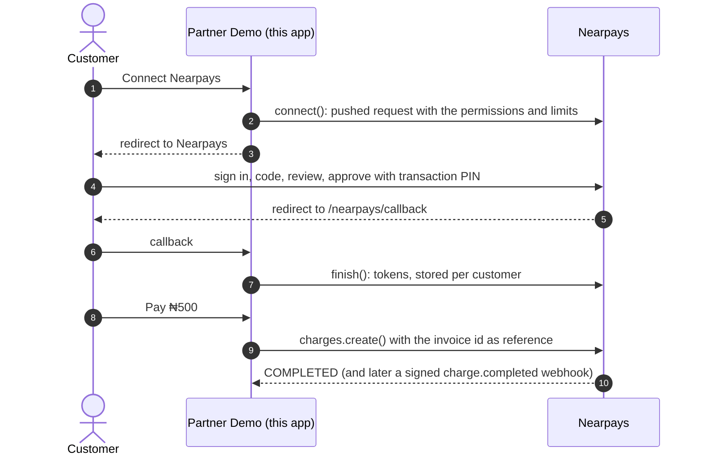

# Nearpays partner demo

A small, complete partner website built on
[`@nearpays/partner`](https://www.npmjs.com/package/@nearpays/partner). Use it
to see the whole integration working end to end, or as a starting point for
your own.

It plays a business ("Partner Demo") whose users connect their Nearpays
wallets, then:

- **pay an invoice** from their wallet (a ₦500 "Pro plan"), safely retried;
- **buy airtime** from their wallet;
- see their **balance**;
- receive **webhooks** as payments complete, fail or are refunded;
- **disconnect**.

About 400 lines of plain JavaScript: Express, the SDK, nothing else.

```
src/
  server.js     the routes: connect, callback, pay, airtime, webhooks, dashboard
  nearpays.js   the one Nearpays client, and what we ask customers to approve
  store.js      a JSON-file store for connections and the app's own records
  session.js    a stand-in for your own login (two demo users)
  views.js      the HTML pages
  config.js     settings from .env
```

## How it works



The customer approves **everything this app asks for, or nothing**: they can't
untick a permission or lower a limit. So ask for what your service needs. Here
that's in `src/nearpays.js`:

```js
export const CONNECT_REQUEST = {
  balance: true,
  identity: ['email'],
  charge: { maxPerPayment: 5000, maxPerDay: 20000, maxPerMonth: 100000, maxPaymentsPerDay: 5 },
  bills: { maxPerPayment: 2000, maxPerDay: 5000, maxPerMonth: 20000, maxPaymentsPerDay: 3, channels: ['AIRTIME', 'DATA'] },
};
```

Nothing may exceed the ceilings Nearpays set when it registered you.

## Run it

You need Node.js 20 or later.

### 1. Install

```bash
git clone https://github.com/nearpays/nearpays-partner-demo.git
cd nearpays-partner-demo
npm install
```

### 2. Make your keys

```bash
npm run keygen
```

This writes `.keys/nearpays-private-key.json`, which stays on your server and
is never committed (`.keys/` is git-ignored), and
`.keys/nearpays-public-jwks.json`, which you send to Nearpays.

### 3. Get registered on staging

Send Nearpays:

| What | For this demo |
|---|---|
| Public keys | `.keys/nearpays-public-jwks.json` |
| Redirect URI | `<APP_URL>/nearpays/callback` |
| Webhook URL | `<APP_URL>/nearpays/webhooks` |
| Permissions | charges, bills (airtime, data), balance, email |
| Limits | at least the ones in `CONNECT_REQUEST` |
| Settlement account | your Nearpays **business** account; charges land here |

You get back a **client id** (`npc_…`) and a **webhook signing secret**.

> **Webhooks need a public address.** Nearpays can't reach `localhost`. To
> receive them on your laptop, expose port 3000 with a tunnel, for example
> `cloudflared tunnel --url http://localhost:3000` or `ngrok http 3000`, and use
> the https address it gives you as `APP_URL`, in your registration and in
> `.env`. Without a tunnel everything else still works; the webhooks panel just
> stays empty, and payments that finish later (pending bills) won't update.

### 4. Configure

```bash
cp .env.example .env
```

Fill in `NEARPAYS_CLIENT_ID`, `NEARPAYS_WEBHOOK_SECRET` and `APP_URL`.
`NEARPAYS_BASE_URL` already points at staging:

| Environment | `NEARPAYS_BASE_URL` |
|---|---|
| Staging | `https://p01--au-api--kwy26k2wm4fb.code.run/api/v2` |
| Production | `https://api.nearpays.com:8443/api/v2` |

### 5. Start

```bash
npm start
```

Open `APP_URL` (http://localhost:3000 by default). Use `npm run dev` to restart
on every change.

## Try it

1. **Sign in** as Ada or Tunde. This stands in for your own login; the user's
   id is what the SDK calls the `customer`.
2. **Connect Nearpays.** You're sent to Nearpays: sign in with a staging
   account, enter the code it emails you, review what Partner Demo asks for,
   and approve with your transaction PIN. You come back connected, with your
   balance showing.

   No staging account of your own? Use one of the shared test customers
   (`ada.test@example.com`, `tunde.test@example.com`,
   `chioma.test@example.com`), with the password `Password@1234`, the code
   `123456` where Nearpays would email one, and the PIN `1234`. Staging
   only; see *Testing on staging* in the partner guide at `/partners`.
3. **Pay ₦500 now.** The charge lands in the business account you registered.
   Press **Retry** on any invoice to see idempotency: the same invoice id is
   sent as the reference, and Nearpays returns the first result instead of
   charging again.
4. **Buy airtime.** On staging these numbers skip the real network, with
   any provider selected:

   | Number | What happens |
   |---|---|
   | `+2348000000001` | `COMPLETED` at once |
   | `+2348000000002` | `PENDING`, then a `bill.completed` webhook about 15 seconds later |
   | `+2348000000003` | Fails, and the wallet is refunded (`bill.refunded`) |

   Numbers starting `0` are sent in `+234` form. If Nearpays takes too long,
   the top-up stays processing rather than failing: the webhook settles it.
5. **Go over a limit**, for example by paying more than 5 invoices in a day.
   The refusal says what's left today and this month.
6. **Disconnect**, here or in Nearpays → Security → Connected apps. Either way
   the connection ends; from Nearpays, a `grant.revoked` webhook tells this app.

## Where each part of the SDK is used

| What | Where | SDK call |
|---|---|---|
| The client | `src/nearpays.js` | `new Nearpays({ baseUrl, clientId, privateKey, redirectUri, webhookSecret, store })` |
| Start connecting | `POST /connect` | `nearpays.connect({ customer, ...CONNECT_REQUEST })` |
| Come back from Nearpays | `GET /nearpays/callback` | `nearpays.finish(req.originalUrl)` |
| Balance and permissions | `GET /` | `nearpays.balance(customer)`, `nearpays.connection(customer)` |
| Charge | `pay()` | `nearpays.charges.create(customer, { amount, reference, description })` |
| Airtime | `POST /airtime` | `nearpays.bills.buy(customer, { channel, category, customerId, amount, reference })` |
| Webhooks | `POST /nearpays/webhooks` | `nearpays.webhooks.express({ 'charge.completed': …, … })` |
| Disconnect | `POST /disconnect` | `nearpays.disconnect(customer)` |
| Errors | `explain()` | `NearpaysError` (`code`, `headroom`), `NotConnectedError` |

Things worth copying:

- **Every payment has your own reference** (the invoice or top-up id). Retries
  then can't double-charge, and webhooks can be matched back to your records.
- **The webhook route is mounted before the body parsers**, with
  `express.raw()`. The signature is checked over the exact bytes Nearpays
  sent, so the body must not be parsed first.
- **The callback checks the connection belongs to the signed-in user**, so a
  sign-in started by someone else can't attach to the wrong account.
- **Token refresh is automatic.** Every SDK call refreshes the access token
  when it is due; the app never handles tokens.

## Going to production

This demo cuts corners that a real service must not:

- **Storage.** `src/store.js` keeps everything in one JSON file. Use your
  database or Redis. The SDK's values are secrets (tokens and keys): encrypt
  them at rest and never log them.
- **More than one server.** Implement the store's `lock()` across instances
  (for example with Redis locks). A refresh token works exactly once, and
  Nearpays treats a second use as theft and disconnects the customer.
- **Login.** Replace `src/session.js` with your real authentication.
- **Secrets.** Load the private key and webhook secret from a secret manager,
  not from files on disk.
- **HTTPS everywhere**, and production's `NEARPAYS_BASE_URL`, client id, keys
  and webhook secret, which are different from staging's.

## Troubleshooting

| You see | It means |
|---|---|
| `invalid_client` when connecting | The client id, the private key, or the public keys Nearpays holds don't match |
| `redirect_uri` error | `APP_URL` doesn't match the redirect URI you registered, character for character |
| "Your Nearpays connection has ended" | The customer disconnected, or the connection expired: connect again |
| `mandate_limit_exceeded` | Over a limit the customer approved; the message says what's left |
| `mandate_unavailable` | The customer paused payments in the Nearpays app |
| No emailed code during approval | Check spam; the code goes to the Nearpays account's email |
| Webhooks panel stays empty | Nearpays can't reach `APP_URL`: use a tunnel (step 3) |

## Licence

MIT
